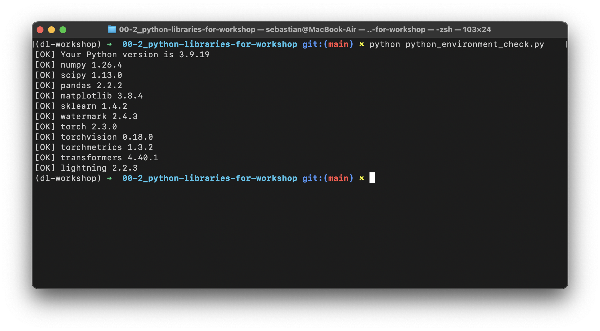
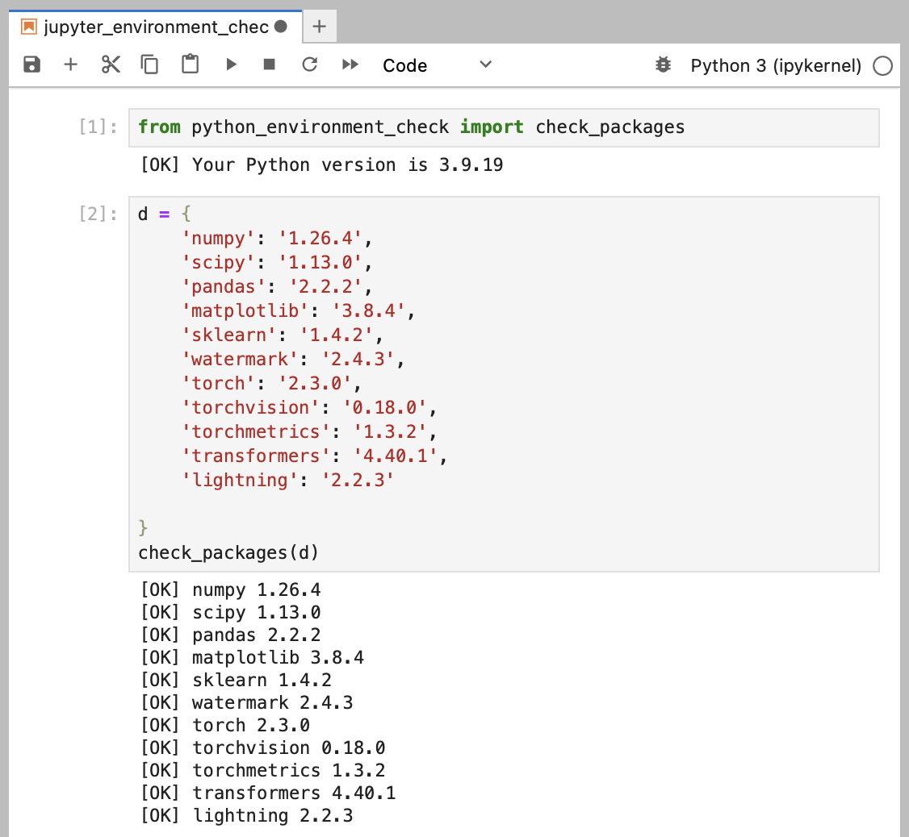

# Libraries Used In This Workshop

&nbsp;

> [!TIP]
> A reproducible cloud environment will be shared with participants on the day of the workshop, so no setup steps are required. However, this document provides suggestions for those who wish to install the dependencies locally on their own machines.

&nbsp;

---


We will be using the following libraries in this workshop, and I highly recommend installing them before attending the event:

- numpy >= 1.26.4 (The fundamental package for scientific computing with Python)
- scipy >= 1.13.0 (Additional functions for NumPy)
- pandas >= 2.2.2 (A data frame library)
- matplotlib >= 3.8.4 (A plotting library)
- jupyterlab >= 4.0 (An application for running Jupyter notebooks)
- ipywidgets >= 8.0.6 (Fixes progress bar issues in Jupyter Lab)
- scikit-learn >= 1.4.2 (A general machine learning library)
- watermark >= 2.4.3 (An IPython/Jupyter extension for printing package information)
- torch >= 2.3.0 (The PyTorch deep learning library)
- torchvision >= 0.18.0 (PyTorch utilities for computer vision)
- torchmetrics >= 1.3.2 (Metrics for PyTorch)
- transformers >= 4.40.1 (Language transformers and LLMs for PyTorch)
- lightning >= 2.2.3 (A library for advanced PyTorch features: multi-GPU, mixed-precision etc.)

To install these requirements most conveniently, you can use the `requirements.txt` file:

```
pip install -r requirements.txt
```


Then, after completing the installation, please check if all the packages are installed and are up to date using

```
python_environment_check.py
```



It's also recommended to check the versions in JupyterLab by running the `jupyter_environment_check.ipynb` in this directory. Ideally, it should look like as follows:



If you see the following issues, it's likely that your JupyterLab instance is connected to wrong conda environment:


In this case, you may want to use `watermark` to check if you opened the JupyterLab instance in the right conda environment using the `--conda` flag:


